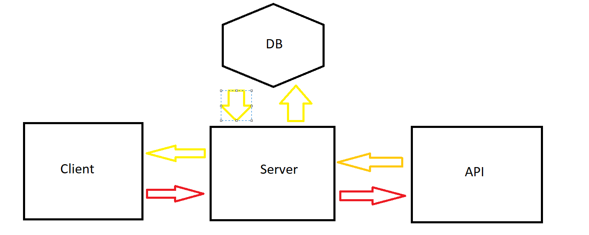

# Movies-Library 1.0.1

**Author Name** : Ibraheem Hammoudeh

## WRRC

## Overview

Backend for a server sending requests to movies web API to handle the information sent to the client,
with the ability of connecting to DB.

## Getting Started

most important routes are /search and /trending , this data will be sent to the client when the said routes used : movie id, title, poster path, release date, overview.
You can also use /getMovies to get all the movies data from DB and use /addMovie to add a movie to the DB through the body of the request.

## Project Features

- ability to add data to DB.
- ability to get all data from DB.
