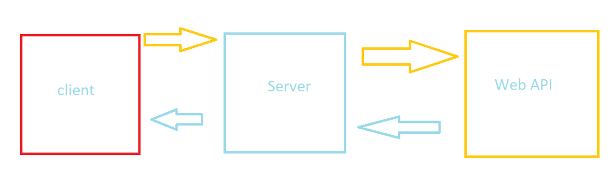

# Movies-Library 1.0.0

**Author Name** : Ibraheem Hammoudeh

## WRRC

## Overview

Backend for a server sending requests to movies web API to handle the information sent to the client

## Getting Started

most important routes are /search and /trending , this data will be sent to the client when the said routes used : movie id, title, poster path, release date, overview.

## Project Features

currently in development
