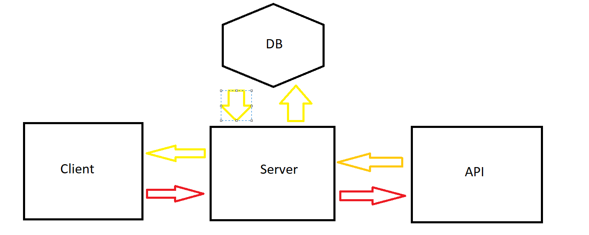

# Movies-Library 1.0.2

**Author Name** : Ibraheem Hammoudeh

## WRRC

## Overview

Backend for a server sending requests to movies web API to handle the information sent to the client,
with the ability of connecting to DB and manipulating the data.

## Getting Started

most important routes are /search and /trending , this data will be sent to the client when the said routes used : movie id, title, poster path, release date, overview.
full CRUD requests have been added and you can also get movie by id using /getMovieId/'the id'

## Project Features

- ability to add data to DB.
- ability to get all data from DB.
- can change tables in DB.
- can delete stuff from DB.
